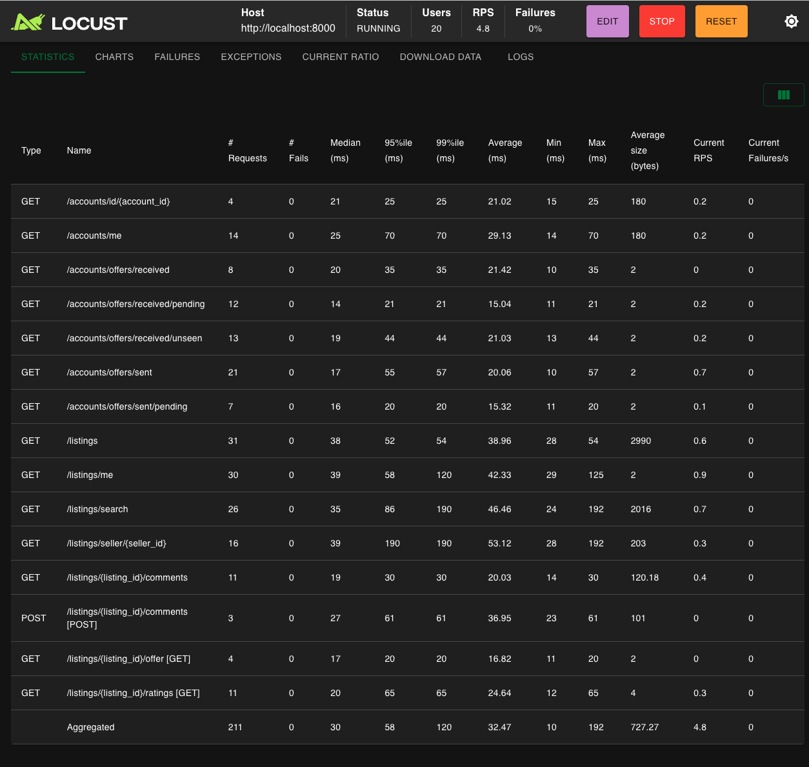
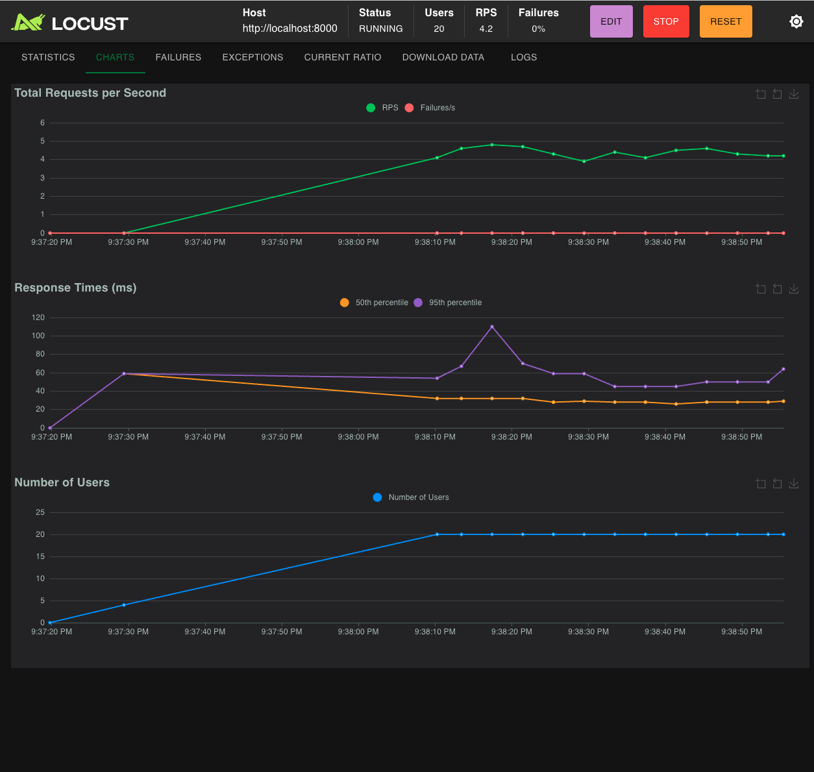

# Load Test Report

---

## Endpoint Breakdown

---

## Throughput & Response Time Over Time

---

## Conclusion

The backend handles 20 concurrent users with **0% failure rate** and response times well under 200 ms across all endpoints. The system demonstrates stable throughput with no degradation as user load increases, indicating the backend is ready to handle the expected production load.
