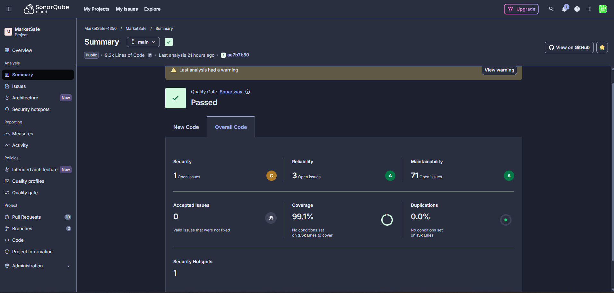
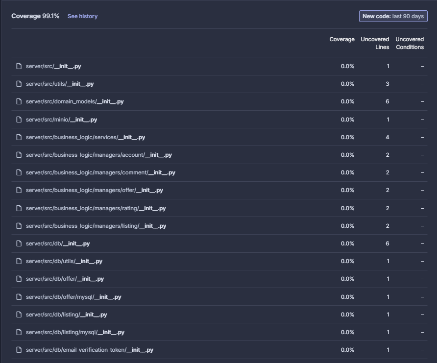
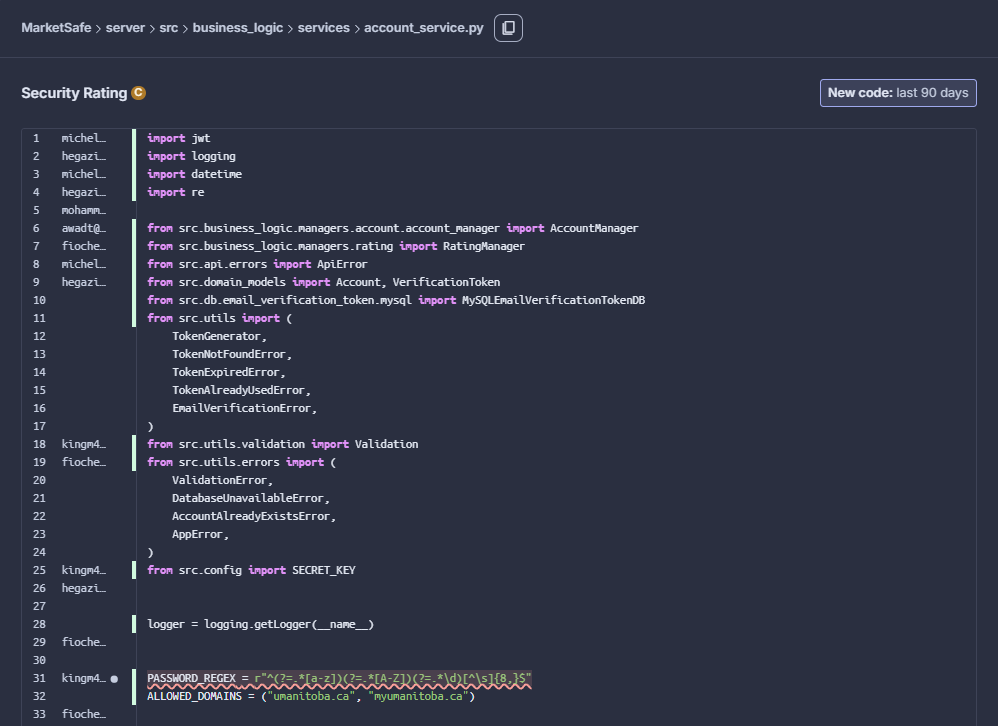

# SonarQube Security Scan Report

## Summary

The overall **Quality Gate status is Passed**. The scan was run against approximately 9.5k lines of code.

| Metric            | Result         | Grade |
| ----------------- | -------------- | ----- |
| Security          | 1 open issue   | —     |
| Reliability       | 3 open issues  | A     |
| Maintainability   | 71 open issues | A     |
| Accepted Issues   | 0              | —     |
| Coverage          | 99.1%          | —     |
| Duplications      | 0.0%           | —     |
| Security Hotspots | 1              | —     |

---

## Scope: Backend Only

The SonarQube scan was configured to analyze the **backend (Python) codebase only**. The frontend was intentionally excluded because frontend coverage tooling produces incomplete results in our setup, and including it would artificially deflate the overall coverage metric. Keeping the scan backend-only ensures the reported coverage accurately reflects the quality of the code being measured.

---

## Coverage (99.1%)

The project achieves **99.1% code coverage**. The small gap from 100% is not due to untested business logic — the uncovered files are almost entirely `__init__.py` files. These files exist only to mark directories as Python packages and contain no executable logic, so they cannot be meaningfully tested. Excluding these empty package markers, the actual application code is effectively fully covered.

---

## Security Rating Issue

SonarQube flagged **1 security issue** in `server/src/business_logic/services/account_services.py`. The flag is a **false positive**.

The flagged line contains a **regular expression used to validate password format** (e.g., checking that a password meets minimum complexity requirements). SonarQube's static analysis detected a string that resembles a password pattern and raised a "hardcoded credential" warning. However, this is strictly a **validation regex**, not an actual credential or secret. No real password is stored or embedded in the code.

This issue has been reviewed and accepted as a false positive. No remediation is required.
